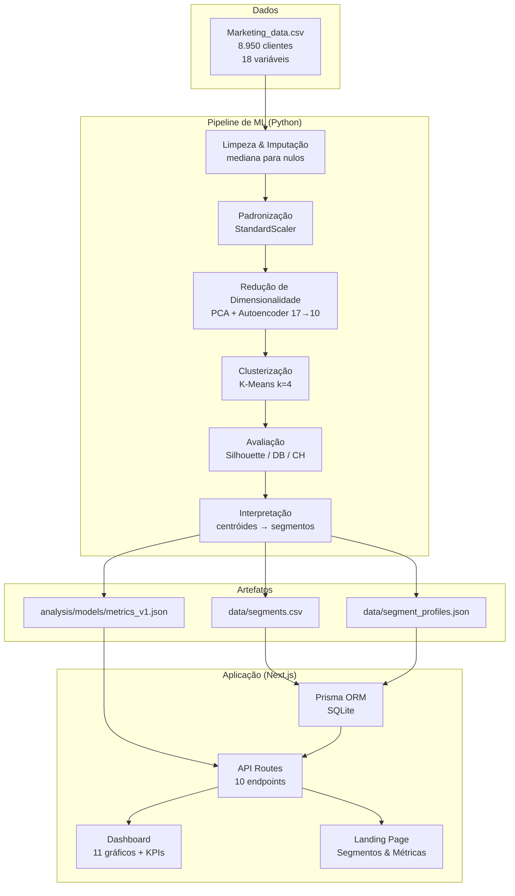
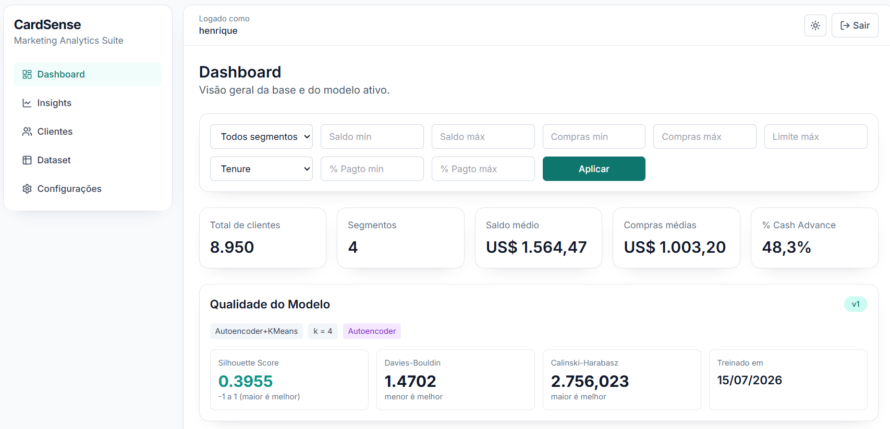
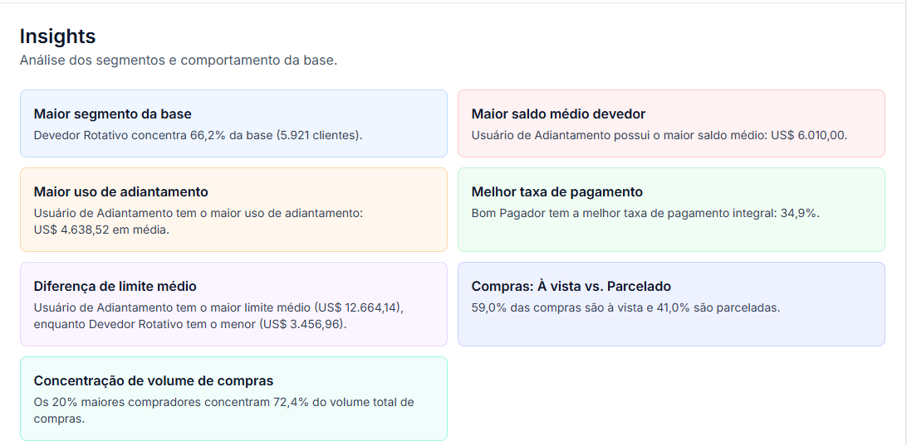
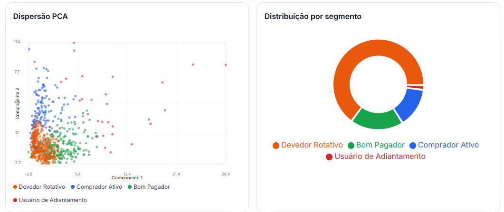
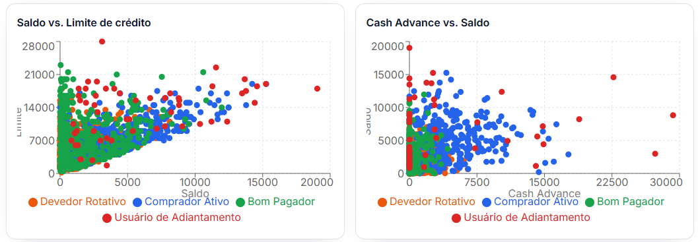
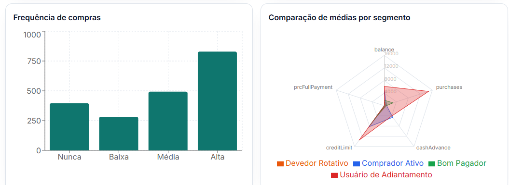
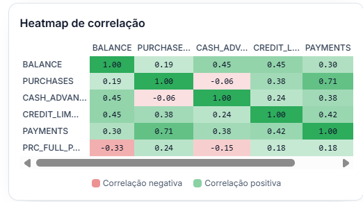
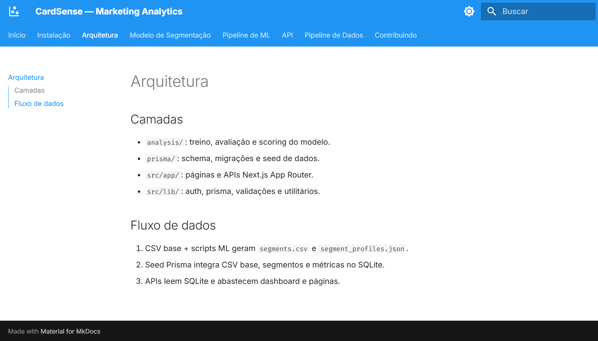
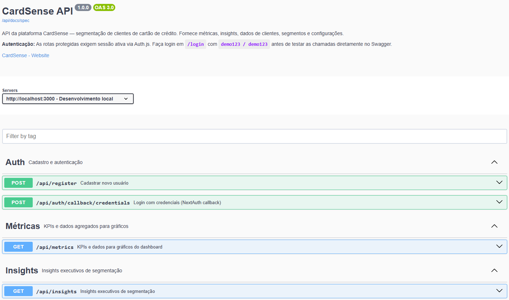

<p align="center">
  <h1 align="center">CardSense</h1>
  <p align="center">
    <em>Plataforma de Segmentação Inteligente de Clientes para Marketing</em>
  </p>
  <p align="center">
    <a href="https://nextjs.org/"></a>
    <a href="https://react.dev/"></a>
    <a href="https://www.typescriptlang.org/"></a>
    <a href="https://tailwindcss.com/"></a>
    <a href="https://www.prisma.io/"></a>
    <a href="https://sqlite.org/"></a>
  </p>
  <p align="center">
    <a href="https://www.python.org/"></a>
    <a href="https://scikit-learn.org/"></a>
    <a href="https://www.tensorflow.org/"></a>
    <a href="https://pandas.pydata.org/"></a>
    <a href="https://authjs.dev/"></a>
    <a href="https://recharts.org/"></a>
  </p>
  <p align="center">
    <a href="https://vitest.dev/"></a>
    <a href="https://docs.pytest.org/"></a>
    <a href="https://squidfunk.github.io/mkdocs-material/"></a>
    <a href="https://swagger.io/"></a>
    <a href="https://eslint.org/"></a>
    <a href="https://docs.astral.sh/ruff/"></a>
  </p>
</p>

---

CardSense é uma plataforma de **Marketing Analytics** que combina ciência de dados, aprendizado não supervisionado e engenharia full stack para descobrir segmentos comportamentais entre clientes de cartão de crédito, explicar seus perfis e apoiar decisões de campanhas personalizadas.

Projeto de portfólio profissional de **Cientista de Dados Sênior**, defensável em entrevistas técnicas.

**Demo online:** [https://departamento-marketing-ml.onrender.com](https://departamento-marketing-ml.onrender.com)

---

## Arquitetura do Sistema

O fluxo abaixo ilustra como dados, ML e frontend se integram:



## Por Que Este Projeto Existe

- Pipeline de **ML ponta a ponta** com dados reais: tratamento, redução de dimensionalidade (PCA + Autoencoder), clusterização (K-Means) e avaliação (Silhouette, Davies-Bouldin, Calinski-Harabasz).
- **Interpretação de segmentos** com variáveis dominantes e recomendações acionáveis de marketing.
- **Produto full stack funcional**: autenticação, dashboard, filtros globais, 11 gráficos interativos, dataset explorável e documentação técnica.
- **Boas práticas de qualidade**: testes TypeScript (Vitest) + Python (pytest), lint (ESLint, Ruff), type checking (tsc, Pyright), documentação (MkDocs) e Swagger UI.

## Segmentos Descobertos

O modelo não supervisionado identificou **4 perfis comportamentais** na base de clientes:

| Segmento | Perfil |
|---|---|
| **Comprador Ativo** | Alta frequência e volume de compras, baixo uso de adiantamento |
| **Devedor Rotativo** | Alto saldo devedor, baixa taxa de pagamento integral da fatura |
| **Usuário de Adiantamento** | Alto Cash Advance e frequência, poucas compras |
| **Bom Pagador** | Alta taxa de pagamento integral, baixo saldo devedor |

## Principais Funcionalidades

- Dashboard executivo com KPIs, filtros globais (segmento, saldo, limite, compras, tenure) e 11 gráficos interativos.
- Segmentação comportamental com **Autoencoder + K-Means** (`k=4`).
- Painel de qualidade do modelo com **Silhouette Score**, Davies-Bouldin, Calinski-Harabasz e curva do cotovelo.
- Página de insights executivos calculados dinamicamente a partir do banco.
- Lista de clientes com busca, filtros, paginação, ordenação e exportação CSV.
- Detalhe individual do cliente com comparativo vs. média do segmento e média geral.
- Dataset completo com paginação (25 a 1000 itens), busca por CUST_ID e exportação CSV.
- Configuração de rótulos de segmentos e versão ativa do modelo.
- Login/cadastro com **Auth.js**, **bcrypt** e usuário demo.
- Tema claro/escuro e layout responsivo (mobile-first).
- Documentação interativa das APIs via **Swagger UI** (`/api/docs`).

## Capturas de Tela



*Dashboard executivo com indicadores, filtros por segmento e visão geral do modelo.*



*Insights estratégicos calculados a partir dos dados de clientes e segmentos.*






*Painel de 11 gráficos interativos: distribuição de segmentos, perfil de gastos, análise de crédito e correlação de variáveis.*



*Documentação técnica completa com MkDocs Material.*



*Swagger UI com todas as rotas documentadas e schemas de request/response.*

## Stack

### Frontend & Backend
| Tecnologia | Uso |
|---|---|
| [Next.js 16](https://nextjs.org/) + [App Router](https://nextjs.org/docs/app) | Framework full stack |
| [React 19](https://react.dev/) | Interface de usuário |
| [TypeScript 5](https://www.typescriptlang.org/) | Tipagem estática |
| [Tailwind CSS 4](https://tailwindcss.com/) | Estilização utilitária |
| [Prisma ORM 6](https://www.prisma.io/) + [SQLite](https://sqlite.org/) | Banco de dados |
| [Auth.js](https://authjs.dev/) | Autenticação por credenciais |
| [Recharts](https://recharts.org/) | Gráficos interativos |
| [Zod](https://zod.dev/) | Validação de schemas |
| [PapaParse](https://www.papaparse.com/) | Parsing de CSV |

### Machine Learning
| Tecnologia | Uso |
|---|---|
| [Python 3.12](https://python.org/) | Pipeline de ML |
| [scikit-learn](https://scikit-learn.org/) | PCA, K-Means, métricas de cluster |
| [TensorFlow / Keras](https://www.tensorflow.org/) | Autoencoder (redução não linear) |
| [pandas](https://pandas.pydata.org/) / [numpy](https://numpy.org/) | Manipulação de dados |
| [matplotlib](https://matplotlib.org/) / [seaborn](https://seaborn.pydata.org/) | Visualizações de avaliação |

### Qualidade & Documentação
| Tecnologia | Uso |
|---|---|
| [Vitest](https://vitest.dev/) + [Testing Library](https://testing-library.com/) | Testes TypeScript |
| [pytest](https://docs.pytest.org/) | Testes Python |
| [ESLint](https://eslint.org/) | Lint TypeScript |
| [Ruff](https://docs.astral.sh/ruff/) | Lint + format Python |
| [Pyright](https://microsoft.github.io/pyright/) | Type checking Python (basic) |
| [MkDocs Material](https://squidfunk.github.io/mkdocs-material/) | Documentação técnica |
| [Swagger UI](https://swagger.io/tools/swagger-ui/) | Documentação interativa de APIs |

## Como Executar

### Docker (recomendado — requer apenas Docker)
```bash
docker compose up --build
```

Acesse **http://localhost:3000**.

### Desenvolvimento local

#### Pré-requisitos
- Node.js 20 LTS+
- Python 3.12+
- npm

#### 1. Instalar dependências JavaScript
```bash
npm install
```

#### 2. Preparar ambiente Python
```bash
pip install -e .[dev]
```

#### 3. Gerar artefatos de ML
```bash
npm run ml:train
npm run ml:segments
```

#### 4. Criar banco e carregar dados
```bash
npx prisma migrate dev
npm run db:seed
```

#### 5. Iniciar aplicação
```bash
npm run dev
```

Acesse **http://localhost:3000**.

## Credenciais Demo
| Campo | Valor |
|---|---|
| Login | `demo123` |
| Senha | `demo123` |

## Scripts Úteis

| Comando | Descrição |
|---|---|
| `npm run dev` | Inicia o app em desenvolvimento |
| `npm run build` | Gera build de produção |
| `npm run typecheck` | Valida TypeScript |
| `npx eslint src --ext .ts,.tsx` | Roda ESLint |
| `npm run test` | Roda testes TypeScript |
| `npm run test:cov` | Cobertura de testes TypeScript |
| `npm run db:seed` | Importa CSV, segmentos, métricas e usuário demo |
| `npm run db:relabel` | Reaplica rótulos de segmento no banco |
| `npm run ml:train` | Executa pipeline de clusterização |
| `npm run ml:segments` | Gera artefatos de segmentos |
| `npm run docs:serve` | Serve documentação MkDocs |
| `npm run docs:build` | Valida build da documentação |
| Swagger UI | Acesse `http://localhost:3000/api/docs` |

## Validação de Qualidade

Antes de publicar ou demonstrar, execute a suite completa:

```bash
npm run typecheck
npx eslint src --ext .ts,.tsx
npm run test
npm run test:cov
pytest analysis/tests -q
ruff check analysis
pyright analysis
npm run docs:build
npm run build
```

## APIs Principais

Documentação interativa: **http://localhost:3000/api/docs** (Swagger UI)

| Método | Rota | Descrição |
|---|---|---|
| `POST` | `/api/register` | Cadastro de usuário |
| `GET` | `/api/insights` | Insights executivos |
| `GET` | `/api/segments` | Perfis dos segmentos + métricas do modelo |
| `GET` | `/api/customers` | Lista de clientes (filtros, paginação, export) |
| `GET` | `/api/customers/[id]` | Detalhe do cliente |
| `GET` | `/api/dataset` | Dataset completo paginado |
| `GET` | `/api/dataset/download` | Download do CSV completo |
| `GET / PATCH` | `/api/settings` | Configurações de segmentação |

## Decisões Técnicas Importantes

- O problema é **não supervisionado** — não há variável-alvo. Os segmentos são descobertos a partir dos dados.
- `k=4` foi fixado com apoio da **curva do cotovelo** + **Silhouette Score**, priorizando interpretabilidade de negócio.
- **Autoencoder** (17→10 dimensões) foi usado para redução não linear antes do K-Means, com o PCA servindo como baseline e para visualização 2D.
- Outliers foram mantidos; a padronização com `StandardScaler` reduz seu impacto. A decisão está documentada no model card.
- Valores ausentes (`MINIMUM_PAYMENTS` ~3,5%, `CREDIT_LIMIT` 1 registro) foram imputados com a mediana.
- A ferramenta é **apoio à decisão de marketing**, não decisão automática sobre clientes.
- Dados são estáticos e anonimizados para fins de portfólio.

## Privacidade e Limitações

- Dataset público e anonimizado (Kaggle), sem PII real.
- Segmentos são aproximações estatísticas — devem ser interpretados com contexto de negócio.
- O projeto não implementa RBAC, multi-tenant ou integração com CRM externo.
- Inferência online não faz parte do MVP; a atribuição de segmentos é batch.
